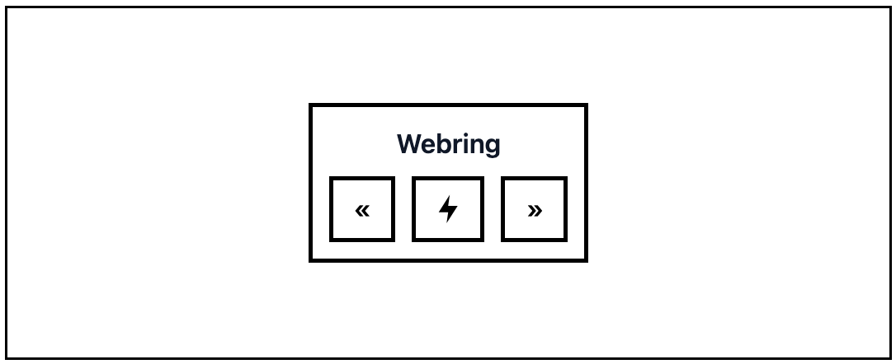

# Webring for Rails

Webring for Rails (webring_rails) is a flexible engine for creating and managing a webring system in your Ruby on Rails application. A webring is a collection of websites linked together in a circular structure, allowing visitors to navigate from one site to another.

## Table of Contents

- [Features](#features)
- [Requirements](#requirements)
- [Installation](#installation)
  - [Quick Start](#quick-start)
  - [Manual Setup](#manual-setup)
  - [Configuration Options](#configuration-options)
  - [Setting Up Your Host Application](#setting-up-your-host-application)
- [Usage](#usage)
  - [Generators](#generators)
    - [Installation Generator](#installation-generator)
    - [Member Model Generator](#member-model-generator)
    - [Navigation Controller Generator](#navigation-controller-generator)
  - [Basic Implementation](#basic-implementation)
  - [Customizing Your Webring](#customizing-your-webring)
- [Models](#models)
  - [Webring::Member](#webringmember)
- [Modules](#modules)
  - [Webring::Navigation](#webringnavigation)
    - [Key Features](#key-features)
    - [Available Methods](#available-methods)
    - [Usage in Models](#usage-in-models)
    - [Implementation Example](#implementation-example)
    - [Customizing Navigation Behavior](#customizing-navigation-behavior)
- [Controllers](#controllers)
  - [Webring::NavigationController](#webringnavigationcontroller)
    - [How to Use the Navigation Controller](#how-to-use-the-navigation-controller)
    - [Customizing Navigation Behavior](#customizing-navigation-behavior-1)
  - [Webring::MembersController](#webringmemberscontroller)
- [Widget](#widget)
  - [Webring::WidgetController](#webringwidgetcontroller)
  - [Widget.js](#widgetjs)
    - [How to Use the Widget](#how-to-use-the-widget)
    - [Widget Customization Options](#widget-customization-options)
    - [Example With All Options](#example-with-all-options)
    - [Multiple Widgets on the Same Page](#multiple-widgets-on-the-same-page)
- [Development](#development)
  - [Migrations](#migrations)
  - [Testing](#testing)
- [Contributing](#contributing)
- [License](#license)

## Features

Webring for Rails provides the following features:

- Complete MVC structure for managing webring members
- Circular navigation system between member websites
- UID-based member identification for security
- Embeddable JavaScript widget for easy member site integration
- Customizable widget appearance and behavior
- Generators for easy setup and customization
- Extensible architecture for adding custom features

## Requirements

- Ruby 2.7.0 or later
- Rails 6.0 or later
- ActiveRecord-compatible database (MySQL, PostgreSQL, SQLite)

## Installation

### Quick Start

Add this line to your application's Gemfile:

```ruby
gem 'webring_rails'
```

Run:

```bash
# Install the gem
bundle install

# Run the installation generator
rails generate webring:install

# Create the member model and migrations
rails generate webring:member

# Create the navigation controller
rails generate webring:controller

# Run migrations
rails db:migrate
```

### Manual Setup

If you prefer to set things up step by step:

1. Add the gem to your Gemfile:

```ruby
gem 'webring_rails'
```

2. Install the gem:

```bash
bundle install
```

3. Mount the engine in your routes:

```ruby
# config/routes.rb
Rails.application.routes.draw do
  mount Webring::Engine => "/webring"

  # Your other routes...
end
```

4. Create necessary migrations:

```bash
rails generate migration CreateWebringMembers uid:string name:string url:string
```

5. Configure your migration:

```ruby
class CreateWebringMembers < ActiveRecord::Migration[6.0]
  def change
    create_table :webring_members do |t|
      t.string :uid, null: false, index: { unique: true }
      t.string :name, null: false, index: { unique: true }
      t.string :url, null: false, index: { unique: true }

      t.timestamps
    end
  end
end
```

6. Run migrations:

```bash
rails db:migrate
```

### Configuration Options

You can configure the webring engine by creating an initializer:

```ruby
# config/initializers/webring.rb
Webring.setup do |config|
  # Set the primary key type (uuid recommended for production)
  config.primary_key_type = :uuid
end
```

### Setting Up Your Host Application

To properly integrate the webring in your host application:

1. Set up default URL options for mailers in each environment:

```ruby
# config/environments/development.rb
config.action_mailer.default_url_options = { host: 'localhost', port: 3000 }
```

2. Add root route in your application:

```ruby
# config/routes.rb
root to: 'home#index'
```

## Usage

### Generators

WebringRails provides several generators to help you set up webring functionality in your application.

> [!IMPORTANT]
> Make sure to run the generators in the order listed below for the best setup experience.

#### Installation Generator

```bash
rails generate webring:install
```

This generator:
- Mounts the Webring engine in your routes.rb

#### Member Model Generator

```bash
rails generate webring:member
```

This generator:
- Creates the Webring::Member model with uid, name and url fields
- Creates a migration for the members table
- Adds member routes to your routes.rb file

#### Navigation Controller Generator

```bash
rails generate webring:controller
```

This generator:
- Creates the Webring::NavigationController with '/next', '/previous', and '/random' actions
- Adds navigation routes to your routes.rb file

### Basic Implementation

After setting up the gem, you'll need to add members to your webring:

```ruby
# Through the console or in a seed file
Webring::Member.create(name: "My Awesome Site", url: "https://myawesomesite.com")
Webring::Member.create(name: "Another Cool Site", url: "https://anothercoolsite.com")
```

### Customizing Your Webring

You can customize various aspects of your webring:

1. Create custom views:

```bash
rails generate webring:views
```

2. Create a custom navigation controller:

```ruby
# app/controllers/custom_navigation_controller.rb
class CustomNavigationController < Webring::NavigationController
  def next
    # Your custom implementation
    super
  end
end

# config/routes.rb
get 'webring/next', to: 'custom_navigation#next'
```

## Models

### Webring::Member

> [!NOTE]
> The Member model is the core component of your webring, representing each site in the ring.

The Member model includes:

- Validations for presence and uniqueness of `url`, uniqueness of `name`, and presence and uniqueness of `uid`
- Automatic generation of unique UID (32-character hex string) for each member
- Automatic population of `name` from `url` if name is not provided
- Navigation methods for finding next, previous, and random members:
  - `find_next(source_member_uid)` - Finds the next member after the given UID
  - `find_previous(source_member_uid)` - Finds the previous member before the given UID
  - `find_random(source_member_uid: nil)` - Finds a random member, excluding the source member

#### Example Usage

```ruby
# Creating a new member
member = Webring::Member.create(url: "https://example.com", name: "Example Site")

# Finding the next member
next_member = Webring::Member.find_next(member.uid)

# Finding the previous member
prev_member = Webring::Member.find_previous(member.uid)

# Finding a random member (excluding the current one)
random_member = Webring::Member.find_random(source_member_uid: member.uid)
```

## Modules

### Webring::Navigation

> [!TIP]
> The Navigation module is designed to be highly extensible. You can easily override its methods to customize the navigation behavior for your specific needs.

The Navigation module provides methods for navigating through members in a webring pattern. It's designed to be extended by models that act as webring members.

#### Key Features

- **Webring-style navigation**: Implements the circular navigation pattern typical of webrings
- **UID-based member identification**: Uses unique identifiers instead of numeric IDs for security
- **Creation time ordering**: Uses `created_at` timestamps to determine the sequence of members
- **Edge case handling**: Properly handles wraparound at the beginning and end of the ring

#### Available Methods

The module provides three core methods:

- `find_next(source_member_uid)`: Finds the next member in the ring after the specified member
  - If the source member is the last in the ring, it returns the first member
  - Uses creation time for navigation ordering

- `find_previous(source_member_uid)`: Finds the previous member in the ring before the specified member
  - If the source member is the first in the ring, it returns the last member
  - Uses creation time for navigation ordering

- `find_random(source_member_uid: nil)`: Finds a random member in the ring
  - If a source member UID is provided, it excludes that member from the selection
  - If the source member is the only one in the ring, it returns that same member

#### Usage in Models

> [!WARNING]
> Make sure your model has `uid` and `created_at` columns before extending the Navigation module, as they're required for the default implementation.

The module is designed to be extended in your model:

```ruby
class YourMember < ApplicationRecord
  extend Webring::Navigation

  # Your model code...
end
```

#### Implementation Example

The `Webring::Member` model extends the Navigation module:

```ruby
module Webring
  class Member < ApplicationRecord
    extend Webring::Navigation

    # Member model implementation...
  end
end
```

This allows you to call navigation methods on the class:

```ruby
# Find the next member after member with UID 'abc123...'
next_member = Webring::Member.find_next('abc123...')

# Find the previous member before member with UID 'abc123...'
previous_member = Webring::Member.find_previous('abc123...')

# Find a random member (excluding member with UID 'abc123...')
random_member = Webring::Member.find_random(source_member_uid: 'abc123...')
```

#### Customizing Navigation Behavior

You can override the default navigation behavior by creating your own module that includes or extends the Webring::Navigation module:

```ruby
module YourApp
  module CustomNavigation
    include Webring::Navigation

    # Override methods as needed
    def find_next(source_member_uid)
      # Custom implementation for finding the next member
      # For example, you might want to order by name instead of created_at
      source_member = find_by(uid: source_member_uid)
      return order(:name).first unless source_member

      where('name > ?', source_member.name)
        .order(:name)
        .first || order(:name).first
    end
  end
end
```

Then apply your custom navigation module to your model:

```ruby
class YourMember < ApplicationRecord
  extend YourApp::CustomNavigation

  # Your model code...
end
```

**Note**: The Navigation module requires models to have `uid` and `created_at` columns for its default implementation.

## Controllers

### Webring::NavigationController

> [!IMPORTANT]
> The Navigation controller is responsible for handling all webring navigation requests and redirecting users between member sites.

Navigation controller manages the webring navigation flow for end users visiting member sites:

- `next` - Redirects to the next member in the webring
- `previous` - Redirects to the previous member in the webring
- `random` - Redirects to a random member in the webring

This controller handles requests to navigate between members. When a navigation request is received with a source member's UID, the controller determines the appropriate member to navigate to and redirects the user to that member's URL.

#### How to Use the Navigation Controller

To use the navigation controller in your webring implementation, you need to create navigation links that point to your application's navigation routes with the `source_member_uid` parameter.

Example routes:
```
https://your-app.com/webring/previous?source_member_uid=abc123...
https://your-app.com/webring/random?source_member_uid=abc123...
https://your-app.com/webring/next?source_member_uid=abc123...
```

Replace `abc123...` with the actual member UID and `https://your-app.com` with your application's domain.

The controller handles several cases:
- If the source member UID is invalid or not found, it returns a 404 "Member not found" response
- If there are no members in the webring, it returns a 404 "No members in the webring" response
- For `next` and `previous` actions, if the current member is the last or first respectively, it wraps around to the other end of the ring
- For `random` action, it ensures the random member is not the same as the source member (unless there's only one member)

#### Customizing Navigation Behavior

If you want to customize the navigation behavior, you can create your own controller that inherits from the default navigation controller:

```ruby
# app/controllers/my_navigation_controller.rb
class MyNavigationController < Webring::NavigationController
  # Override methods and call super if needed
  def next
    # Your custom logic before default behavior
    super
    # `super` will redirect to member.url, so no code will be executed after this
  end

  def previous
    # Completely custom implementation
    @previous_member = Webring::Member.find_previous(params[:source_member_uid])
    redirect_to @previous_member.url, allow_other_host: true
  end
end
```

Then update your routes to use your custom controller:

```ruby
# config/routes.rb
Rails.application.routes.draw do
  # ... other routes ...

  # Override default webring routes with your custom controller
  get 'webring/next', to: 'my_navigation#next'
  get 'webring/previous', to: 'my_navigation#previous'
  get 'webring/random', to: 'my_navigation#random'
end
```

### Webring::MembersController

Members controller provides full CRUD functionality for managing webring members:

- `index` - Lists all webring members
- `show` - Displays details for a specific member
- `new` - Form for creating a new member
- `create` - Creates a new webring member
- `edit` - Form for editing an existing member
- `update` - Updates an existing webring member
- `destroy` - Deletes a webring member

This controller provides the basic functionality for your application to manage webring membership.

## Widget

### Webring::WidgetController

The Widget controller serves a JavaScript widget that can be embedded on member sites to provide navigation through the webring.

- `show` - Serves the widget.js JavaScript file with proper CORS headers

### Widget.js

The widget.js file is a standalone JavaScript snippet that creates a navigation widget on member sites. It's designed to be easily embedded with a single script tag and offers various customization options.

#### How to Use the Widget

To add the webring widget to a member's site, include the following code:

```html
<!-- Webring Widget -->
<script src='https://yourhub.com/webring/widget.js' data-member-uid='MEMBER_UID'></script>
<div id='webring-widget'></div>
<!-- End Webring Widget -->
```

Replace `https://yourhub.com` with your application's domain and `MEMBER_UID` with the member's unique identifier.

#### Widget Customization Options

The widget can be customized through data attributes on the script tag:

- **Widget Type** (`data-widget-type`):
  - `full`: Text, back button, random button, forward button (default)
  - `no-text`: Back button, random button, forward button (no text)
  - `two-way`: Back and forward buttons (no random)
  - `one-way`: Forward button only

- **Button Text** (`data-button-text`):
  - `true`: Show text labels on buttons (default)
  - `false`: Show only symbols (no text)

- **Styling** (`data-styles`):
  - `full`: Apply all styles (default)
  - `layout`: Only layout styles, no visual design
  - `none`: No styles applied

- **Target Element** (`data-target-id`):
  - Sets a custom ID for the target container (default: `webring-widget`)

#### Example With All Options

```html
<script src='https://yourhub.com/webring/widget.js'
        data-member-uid='MEMBER_UID'
        data-widget-type='full'
        data-button-text='true'
        data-styles='full'
        data-target-id='custom-widget-id'></script>
<div id='custom-widget-id'></div>
```

#### Multiple Widgets on the Same Page

You can include multiple widgets on the same page by specifying different target IDs:

```html
<!-- First Widget -->
<script src='https://yourhub.com/webring/widget.js'
        data-member-uid='MEMBER_UID'
        data-widget-type='full'
        data-target-id='webring-widget-1'></script>
<div id='webring-widget-1'></div>

<!-- Second Widget -->
<script src='https://yourhub.com/webring/widget.js'
        data-member-uid='MEMBER_UID'
        data-widget-type='no-text'
        data-target-id='webring-widget-2'></script>
<div id='webring-widget-2'></div>
```

## Development

To set up the development environment:

1. Clone this repository
2. Run `bundle install`
3. Run `bin/setup_dummy` to prepare the test dummy app

### Migrations

After creating a new migration in the engine, you need to run:
```bash
cd test/dummy
bin/rails db:migrate
```
Which will run the migrations in the dummy app.
You don't need to copy migrations to the dummy app, it looks for them in the engine.

### Testing

> [!WARNING]
> As of now, there are no tests. Contributions to add test coverage are welcome!

## Contributing

We welcome contributions to Webring for Rails! Here's how you can help:

1. Fork the repository
2. Create a feature branch: `git checkout -b my-new-feature`
3. Make your changes and add tests if possible
4. Commit your changes: `git commit -am 'Add some feature'`
5. Push to the branch: `git push origin my-new-feature`
6. Submit a pull request

## License

The gem is available as open source under the terms of the [MIT License](https://opensource.org/licenses/MIT).
